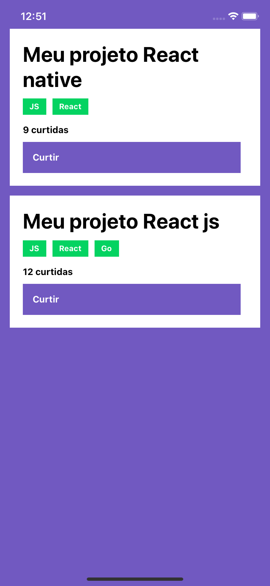

<h3 align="center">
  Desafio 04: Conceitos do React Native 
</h3>

<blockquote align="center">“Sucesso não é o resultado de um jogo, mas o destino de uma jornada”!</blockquote>

<p align="center">
  <a href="https://valdirmendes.dev">
    
  </a>

  

  <a href="https://github.com/valdirmendesdev/gostack-conceitos-react-native/stargazers">
    
  </a>
</p>

<p align="center">
  <a href="#rocket-sobre-o-desafio">Sobre o desafio</a>&nbsp;&nbsp;&nbsp;|&nbsp;&nbsp;&nbsp;
  <a href="#memo-licença">Licença</a>
</p>

## :rocket: Sobre o desafio

Nesse desafio, foi proposto criar uma aplicação para treinar o que aprendemos de conceitos básicos do React Native!

A aplicação proposta consiste em construirmos e integramos o aplicativo em React Native com o backend em Node.js. O aplicativo deverá permitir listar e curtir repositórios do portifólio.

### Funcionalidades da aplicação

- **`Listar os repositórios da sua API`**: Exiber uma lista com o título, tecnologias e curtidas de todos os repositórios que estão cadastrados na API backend.

- **`Curtir um repositório da sua API`**: Permite curtir um respositório da API através de um botão com o texto **Curtir**.

<p align="center">
  
</p>

## Dependências da aplicação

Este repositório contém apenas o código da aplicação frontend. Para ver funcionando a integração frontend + backend é necessário que a aplicação backend contida no repositório [Conceitos de Node.js](https://github.com/valdirmendesdev/gostack-conceitos-nodejs) esteja rodando.

## :running: Rodando a aplicação

Para executar a aplicação, clone este repositório, entre na pasta do projeto e instale as dependências com o seguinte comando no terminal:

```bash
yarn
```

**Atenção**: Caso você esteja emulando no iOS, na pasta do projeto navegue até a pasta ios executando o comando `cd ios` e depois execute `pod install` para instalar todas as dependências para o iOS.

### :running: Rodando no emulador do iOS

Para rodar a aplicação no emulador do iOS, execute o seguinte comando no terminal:

```bash
yarn ios
```

ou

```bash
npx react-native run-ios
```

### :running: Rodando no emulador android

Para rodar a aplicação no emulador do Android, execute o seguinte comando no terminal:

```bash
yarn android
```

ou

```bash
npx react-native run-android
```

### :running: Rodando os testes automatizados

Para rodar os testes automatizados, execute o seguinte comando no terminal:

```bash
yarn test
```

## :memo: Licença

Esse projeto está sob a licença MIT. Veja o arquivo [LICENSE](LICENSE) para mais detalhes.
